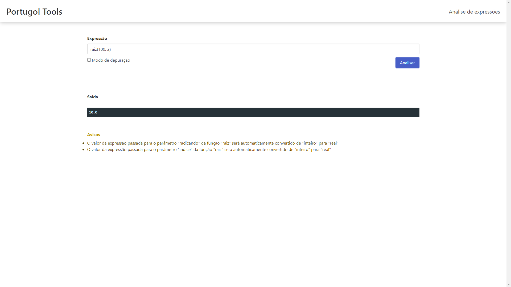

# Portugol Expression Parser

A ideia deste projeto é criar uma interface web simples que processa expressões simples de uma única linha em cima do interpretador do Portugol Studio.

## Utilização

Ao abrir a página inicial, é possível notar o campo para escrever a expressão. Basta preenchê-lo e clicar no botão "Analisar"


Um exemplo de uma expressão:


Um exemplo de uma expressão com erros:


Um exemplo de uma expressão com avisos:



Um exemplo de uma expressão no modo de depuração:


## Hospedagem

Há duas formas de hospedar esta aplicação: em uma [imagem Docker](https://hub.docker.com/r/giancarl021/portugol-expression-parser) ou em um servidor com o [NodeJS](https://nodejs.org/en/) e o [Java](https://www.java.com/) instalados.

### Docker

Para hospedar utilizando o Docker, é necessário utilizar o comando:

```bash
docker run -d -p <PORTA>:80 giancarl021/portugol-expression-parser
```

Em que ``<PORTA>`` é a porta do hospedeiro em que o serviço ficará disponível.

Também é possível modificar a porta interna do serviço, com a flag ``-e PORT=<PORTA>``, caso seja necessário.

### Diretamente no servidor

Para hospedar a aplicação na diretamente no servidor, clone este repositório, utilize um serviço como o [PM2](https://pm2.keymetrics.io/) para manter a aplicação rodando.

Tenha em mente que você precisará tanto do NodeJS quando to Java instalados no servidor e com seus respectivos comandos disponíveis na variável de ambiente ``PATH``.

## API

É possível trabalhar com a API do serviço, sem utilizar a interface gráfica.

### Analisar expressão

É necessária uma requisição HTTP para analisar uma expressão.

Requisição:
```json
{
  "expression": "2 + 2 * 4"
}
```

Resposta:
```json
{
  "warning": [],
  "status": "success",
  "value": "10"
}
```

### Erros
Quando uma expressão não tiver uma análise bem sucedida, será retornada na resposta uma lista de erros.

Requisição
```json
{
  "expression": "2 + 2 * 4 + a"
}
```

Resposta:
```json
{
  "warning": [],
  "status": "error",
  "value": [
    "A variável \"a\" não foi declarada neste escopo"
  ]
}
```

### Avisos
Existem casos em que é possível executar o código, porém com avisos de possíveis melhorias.

Requisição
```json
{
  "expression": "raiz(100, 2)"
}
```

Resposta:
```json
{
  "warning": [
    "O valor da expressão passada para o parâmetro \"radicando\" da função \"raiz\" será automaticamente convertido de \"inteiro\" para \"real\"",
    "O valor da expressão passada para o parâmetro \"indice\" da função \"raiz\" será automaticamente convertido de \"inteiro\" para \"real\""
  ],
  "status": "success",
  "value": "10.0"
}
```

### Modo de depuração

Para utilizar o modo de depuração, simplesmente adicione o valor ``true`` para a chave ``debug`` no corpo da requisição.

Requisição:
```json
{
  "expression": "2 + 2 * 4",
  "debug": true
}
```

Resposta:
```json
{
  "warning": [],
  "program": "programa\n{\n    inclua biblioteca Tipos --> t\n    inclua biblioteca Matematica --> m\n    funcao inicio()\n    {\n        escreva(2 + 2 * 4)\n    }\n}",
  "status": "success",
  "value": "10"
}
```